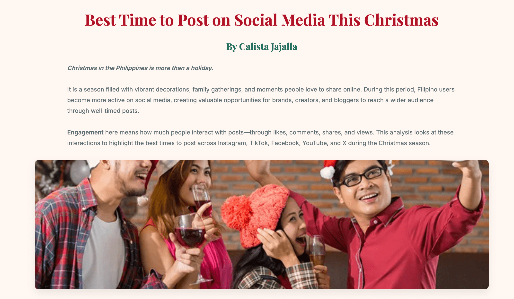
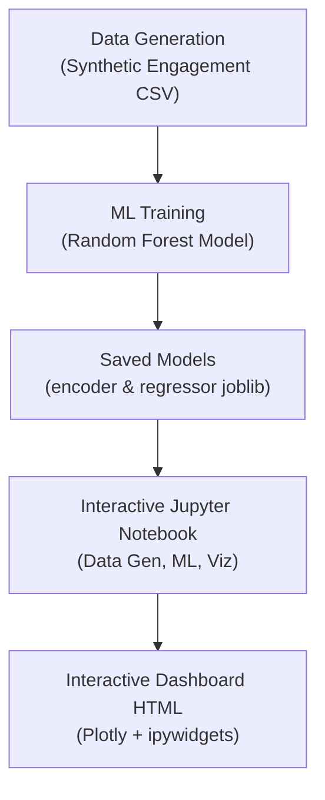
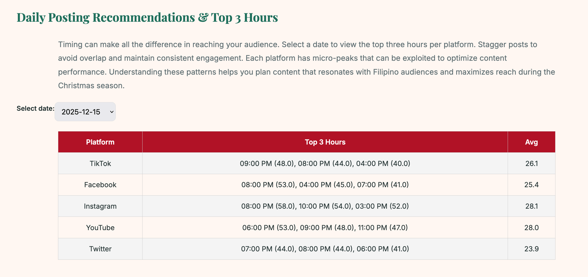

# 📁 Best Time to Post on Social Media This Christmas

---

## About the Project

This project delivers a comprehensive data science pipeline that generates synthetic social media engagement data across multiple platforms during the Christmas season, trains machine learning models to predict optimal posting times, and provides interactive visualization through a rich dashboard.

The goal is to help content creators and marketers understand the best times to post on platforms like TikTok, Facebook, Instagram, YouTube, and Twitter between mid-December and early January, leveraging synthetic but realistic data with holiday and weekly seasonality effects.

---

## Tools & Technologies Used

- **Python** for data generation, ML model training, and visualization (pandas, numpy, scikit-learn, joblib, plotly)  
- **Jupyter Notebook** for interactive development and experimentation  
- **Plotly** for interactive charts and heatmaps  
- **ipywidgets** for dashboard interactivity  
- **Docker Compose** to launch Jupyter Lab environment (optional)  

---

## Concepts Demonstrated

- Synthetic data simulation with realistic temporal and platform-specific engagement patterns  
- Feature engineering for cyclic time variables and categorical encoding  
- Random Forest regression modeling for engagement prediction  
- Interactive dashboards combining heatmaps, top posting hours, and temporal filtering  
- Deployment-ready setup with Docker Compose  

---

## Architecture Diagram

## Website Features

- Heatmaps showing average engagement by hour and platform
- Top 3 posting hours per platform per selected date
- Interactive date selection with ipywidgets dropdown
- Line charts of engagement trends over the day
- Fully exportable to standalone HTML for easy sharing

### Website link: https://calistajajalla.github.io/ph-social-posting-times/interactive_christmas_blog.html

## Next Steps / Recommendations

- Integrate real social media datasets to replace or complement synthetic data

- Add additional ML models for classification of post success or sentiment
- Deploy dashboard as a standalone web app (Streamlit or Dash)
- Enhance interactivity with user-defined filters and export options
- Add notifications or scheduling recommendations for content posting

## References:

- Altrue PH – Best Times to Post on Social Media in the Philippines (2025)
    https://altrue.ph/articles-and-news/best-times-to-post-on-social-media-in-the-philippines-2025/
- Ghosh et al., Understanding Engagement Dynamics on Social Platforms
https://arxiv.org/abs/1901.00076
- Philippine Christmas season behavior patterns (industry heuristics)

